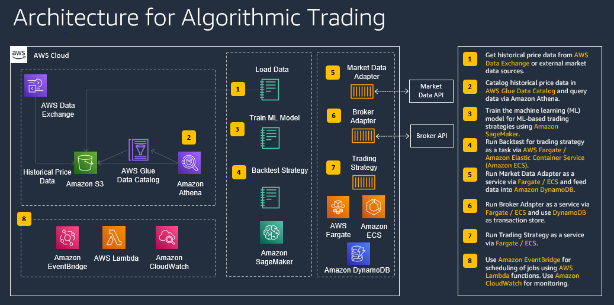

# Algorithmic Trading Proof-of-Concept

The POC demonstrates an ML-based quant research environment. It shows how to load and store financial data on AWS from AWS Data Exchange and other external data sources and how to build and backtest algorithmic trading strategies with Amazon SageMaker that use technical indicators and advanced machine learning models.

## Regions

This workshop has been tested in **us-east-1**.

## Considerations for Each Role
As the team lead on this lean team of one, you'll need to wear multiple hats.  Below are some things we'll cover from the perspective of each role:
* Data Engineer - You'll modify scripts to load external market data to AWS.
* Data Scientist - You'll need to load the data into your machine learning development environment. Once loaded, you'll understand the data, use a machine learning algorithm to train the model and do predictions.
* Trader - You will use different trading strategies based on data to maximize Profit & Loss while attributing to Risk.

## Goals

At minimum, you will have an understanding how to load historical price data from external market data sources like AWS Data Exchange into S3. You get familiar how to store price data in S3 and expose it via Glue Data Catalog and Athena, how to backtested trading strategies using Amazon SageMaker, and how to train machine learning models that are used in trading strategies. You also get a basic understand how trading strategies using trend following and machine learning are developed with Python and can be optimized for better performance.

## Architecture

** backtrader; version 1.9.74.123 -- https://www.backtrader.com/

## Acknowledgements

The work is based on the blog Post (Feb 2021): Algorithmic Trading with SageMaker and AWS Data Exchange: https://aws.amazon.com/blogs/industries/algorithmic-trading-on-aws-with-amazon-sagemaker-and-aws-data-exchange/
Thanks to authors of this post for the ideas and code contribution

## Instructions using SageMaker Notebooks

## Step 0: Set up environment

1. Create a new unique S3 bucket that starts with "**algotrading-**" (e.g. "**algotrading-YYYY-MM-DD-XYZ**") that we use for storing external price data. 
1. For the base infrastructure components (SageMaker Notebook, Athena, Glue Tables), deploy the following [CloudFormation template](https://github.com/aws-samples/algorithmic-trading/raw/master/0_Setup/algo-reference.yaml). Go to [CloudFormation](https://console.aws.amazon.com/cloudformation/home?#/stacks/new?stackName=algotrading) and upload the downloaded CF template. For the S3 bucket specify the previously created bucket name. Verify that stackName is **algotrading** before creating the stack and acknowledge that IAM changes will be made.

## Step 1: Load Historical Price Data

Here are a few data source options for this workshop. The daily datasets can be downloaded and generated in a few minutes, for the intraday dataset, please plan for at least 15 mins.
1. Sample Daily EOD Stock Price Data (from public data source or AWS Data Exchange)

### Option 1a: Sample Daily EOD Stock Price Data (from public data source)

If you are not able to use AWS Data Exchange in your account, you can run instead the following Jupyter notebook that generates some sample EOD price data from a public data souce. Run all the cells in **1_Data/Load_Hist_Data_Daily_Public.ipynb**.

### Option 1b: Sample Daily EOD Stock Price Data (via AWS Data Exchange)

If you want to use AWS Data Exchange, you can download the following [dataset](https://aws.amazon.com/marketplace/pp/prodview-e2aizdzkos266#overview) for example. There are multiple options available, and we picked this for demonstration purposes. 

To download this dataset, complete a subscription request first where you provide the required information for Company Name, Name, Email Address, and Intended Use Case. Once the provider confirms the subscription, you can navigate to [AWS Data Exchange/My subscriptions/Entitled data](https://console.aws.amazon.com/dataexchange/home?#/entitled-data).
Then choose the latest revision for this subscription, select all assets, and click on **Export to Amazon S3**. In the new window select the root folder of the S3 bucket that starts with "*algotrading-data-*". Then click on **Export** and wait until your export job is completed.

In order to use this dataset for algorithmic trading, we want to standardize it to a CSV file with the following columns: **dt, sym, open, high, low, close, vol**.
Once you have successfully exported the dataset, please run the the following Jupyter notebook to format the dataset and store it in the ***hist_data_daily*** folder of your S3 bucket. Go to [Amazon SageMaker/Notebook/Notebook instances](https://console.aws.amazon.com/sagemaker/home?#/notebook-instances), then click on **Open Jupyter** for the provisioned notebook instance. Run all the cells in **1_Data/Load_Hist_Data_Daily.ipynb**.

## Step 2: Backtest a trend following strategy (or move directly to Step 3)

In this module, we backtest a trend following strategy on daily price data with Amazon SageMaker. For these notebooks, please ensure that you have daily price data loaded.

You can choose between the following trading strategies:
1. **Simple Moving Average Strategy**: **2_Strategies/Strategy SMA.ipynb**
2. **Daily Breakout Strategy**: **2_Strategies/Strategy_Breakout.ipynb**

Select the Jupyter Notebook for backtesting the strategy in the folder **2_Strategies** for your selected strategy and run it from your Amazon SageMaker Notebook instance. In the instructions, there is guidance on how to optimize the strategy.

## Step 3: Backtest a machine-learning based strategy

In this module, we backtest a machine-learning strategy with Amazon SageMaker on daily or intraday price data. Please ensure that you have daily or intraday price data loaded before running the corresponding notebooks.

Usually you will have two parts, one for training the machine learning model, and one for backtesting the strategy. You can run both notebooks or skip the training of the model as a trained model is already available in the repository:

**ML Long/Short Prediction Strategy**
* Model Training (Daily Price Data) (Optional): **3_Models/Train_Model_Forecast.ipynb**
* Strategy Backtesting (Daily Price Data): **2_Strategies/Strategy_Forecast.ipynb**
