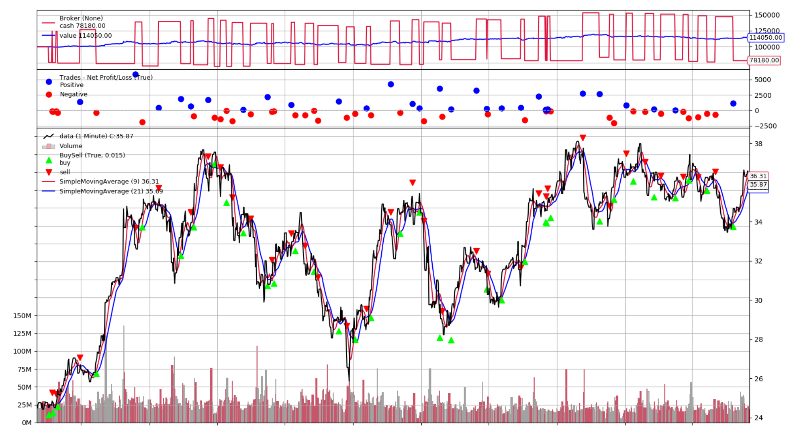
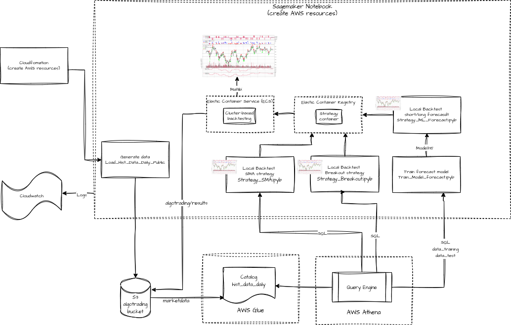

# Algorithmic Trading Proof-of-Concept

The POC demonstrates an ML-based quant research environment. It shows how to load and store financial data on AWS from AWS Data Exchange and other external data sources and how to build and backtest algorithmic trading strategies with Amazon SageMaker that use technical indicators and advanced machine learning models.

Each notebook contains an introduction, where discusses the rationale behind the strategy. Please remember, this is a demo, not an actual trading algo, and the training is done based on a synthetic data. I had no objective to show the alpha, just POC the idea of the quant platform setup

## Regions

This workshop has been tested in **us-east-1**.

## Considerations for Each Role
As the team lead on this lean team of one, you'll need to wear multiple hats.  Below are some things we'll cover from the perspective of each role:
* Data Engineer - You'll modify scripts to load external market data to AWS.
* Data Scientist - You'll need to load the data into your machine learning development environment. Once loaded, you'll understand the data, use a machine learning algorithm to train the model and do predictions.
* Trader - You will use different trading strategies based on data to maximize Profit & Loss while attributing to Risk.

## Goals

At minimum, you will have an understanding how to load historical price data from external market data sources like AWS Data Exchange into S3. You get familiar how to store price data in S3 and expose it via Glue Data Catalog and Athena, how to backtested trading strategies using Amazon SageMaker, and how to train machine learning models that are used in trading strategies. You also get a basic understand how trading strategies using trend following and machine learning are developed with Python and can be optimized for better performance.

## Architecture
First step creates the entire environments using Cloudformation - clusters (with size of 0 initally), Sagemaker environment, roles, etc. 

Then, the syntetic data is generated using **1_Data/Load_Hist_Data_Daily_Public.ipynb** and placed in an S3 bucket. An AWS Glue crawler reads the data and converts it into a table, which can be querried via Athena API. Non-ML strategies (SMA and Breakout) use this data directly, whice in ML-based strategy (**2_Strategies/Strategy_Forecast.ipynb**) there is an intermediary step of trainign and testing the model using **3_Models/Train_Model_Forecast.ipynb**. Each strategy has a hyperparameter file, which can be used to run various cobinations of the parameters for backtesting. 

Each strategy generates a container with all the dependencies. The container can be run locally on the notbook server, or on a Elastic Container cluster. In either case strategies generate files and matlub plots with the results

During the execution logs are sent to the CloudWatch logging service

** backtrader; version 1.9.74.123 -- https://www.backtrader.com/

## Acknowledgements

The work is based on the blog Post (Feb 2021): Algorithmic Trading with SageMaker and AWS Data Exchange: https://aws.amazon.com/blogs/industries/algorithmic-trading-on-aws-with-amazon-sagemaker-and-aws-data-exchange/
Thanks to authors of this post for the ideas and code contribution

## Instructions using SageMaker Notebooks

## Step 0: Set up environment

#. Create a new unique S3 bucket that starts with "**algotrading-**" (e.g. "**algotrading-YYYY-MM-DD-XYZ**") that we use for storing external price data. 
#. For the base infrastructure components (SageMaker Notebook, Athena, Glue Tables), deploy the following [CloudFormation template](https://github.com/aws-samples/algorithmic-trading/raw/master/0_Setup/algo-reference.yaml). Go to [CloudFormation](https://console.aws.amazon.com/cloudformation/home?#/stacks/new?stackName=algotrading) and upload the downloaded CF template. For the S3 bucket specify the previously created bucket name. Verify that stackName is **algotrading** before creating the stack and acknowledge that IAM changes will be made.

## Step 1: Load Historical Price Data

Generate some sample EOD price data from a public data souce. Run all the cells in **1_Data/Load_Hist_Data_Daily_Public.ipynb**.

## Step 2: Backtest a trend following strategy (or move directly to Step 3)

In this module, we backtest a trend following strategy on daily price data with Amazon SageMaker. For these notebooks, please ensure that you have daily price data loaded.

You can choose between the following trading strategies:
1. **Simple Moving Average Strategy**: **2_Strategies/Strategy SMA.ipynb**

This strategy is a moving average crossover system. It buys (goes long) when a faster-period Simple Moving Average (SMA) crosses above a slower-period SMA, signaling an uptrend. Conversely, it sells (goes short) when the faster SMA crosses below the slower SMA, indicating a downtrend. If an opposing signal occurs while a position is open, the strategy reverses its position to align with the new trend direction.

2. **Daily Breakout Strategy**: **2_Strategies/Strategy_Breakout.ipynb**
This strategy, named Breakout, is a trend-following algorithm that uses highest high and the lowest low indicators over a specified period to generate trading signals.

The strategy initiates a long position when the current price surpasses the highest price of the look-back period and a short position when the current price falls below the lowest price of the look-back period. It closes existing long positions if the price drops below the previous period's high and closes short positions if the price rises above the previous period's low. The strategy's behavior can be configured to only go long,only go short, or both.

Select the Jupyter Notebook for backtesting the strategy in the folder **2_Strategies** for your selected strategy and run it from your Amazon SageMaker Notebook instance. In the instructions, there is guidance on how to optimize the strategy.

## Step 3: Backtest a machine-learning based strategy

In this module, we backtest a machine-learning strategy with Amazon SageMaker on daily or intraday price data. Please ensure that you have daily or intraday price data loaded before running the corresponding notebooks.

Usually you will have two parts, one for training the machine learning model, and one for backtesting the strategy. You can run both notebooks or skip the training of the model as a trained model is already available in the repository:

**ML Long/Short Prediction Strategy**
* Model Training (Daily Price Data): **3_Models/Train_Model_Forecast.ipynb**
Model:
* Multilayer Perceptron (MLP) (Feedforward neural network)
* 3 layers: input, hidden, output
* Binary Classification
* `Input`: Close, SMA(2 to 16), ROC(2 to 16)
* `Output`: Does a long or short trade hit the profit target (2%) without hitting a stop loss (1.5%) in the next five days?

This script describes a data pre-processing strategy for generating a machine learning dataset for an algorithmic trading model, rather than being a trading strategy itself. Its primary goal is to create labeled historical data that a machine learning model can learn from to predict future price movements (specifically, whether a long or short trade would be profitable).

Here's a breakdown of the process:

Data Loading and Indicator Calculation:
It loads historical price data (with dt, close, etc.) from a CSV file.
It calculates multiple Simple Moving Averages (SMAs) and Rates of Change (ROCs) with varying timeperiod values (determined by repeatCount and repeatStep). These technical indicators will serve as features for the ML model.

Feature Engineering and Normalization:
For each historical data point, it constructs an "input record" that includes:
* The current closing price.
* The calculated SMA values.
* The calculated ROC values.
* A crucial step is the normalization of the close price and SMA values. They are scaled to a range between 0 and 1, which is common practice for neural networks and other ML models to improve training stability and performance. ROC values are appended directly.

Labeling (Target Variable Creation): This is the core of preparing the data for ML.
For each data point, it looks forwardWindow days into the future (e.g., 5 days).
It then checks two conditions to assign labels:
* "Long" Label (1 or 0): A "long" label is assigned if, within the forwardWindow, the price reaches a profitTarget (e.g., 2% above the current close) AND it does not hit a stopTarget (e.g., 1.5% below the current close) first. This indicates a potential profitable long trade.
* "Short" Label (1 or 0): A "short" label is assigned if, within the forwardWindow, the price reaches a profitTarget (e.g., 2% below the current close) AND it does not hit a stopTarget (e.g., 1.5% above the current close) first. This indicates a potential profitable short trade.
The lCount and sCount variables track how many instances of profitable long and short opportunities are found.

Dataset Export:
All the generated features (normalized close, SMAs, ROCs) and the corresponding "long" and "short" labels are assembled into a new Pandas DataFrame.
This DataFrame is then saved as a CSV file (data.csv). This CSV file is the final prepared dataset ready to be used to train a machine learning model.
In essence, this script is a feature engineering and labeling pipeline designed to create a supervised learning dataset from raw historical price data and technical indicators. The goal is to train an ML model to predict whether a "long" or "short" condition (as defined by the profit and stop targets) will be met in a future window, enabling the model to generate trading signals.

* Strategy Backtesting (Daily Price Data): **2_Strategies/Strategy_Forecast.ipynb**
This strategy, is a Machine Learning (ML)-driven long/short trading strategy built using Backtrader. It leverages a pre-trained Keras model to predict future price movements (specifically, the likelihood of a long or short opportunity) and then executes trades based on these predictions, incorporating profit targets and stop-loss levels.

Here's a breakdown of its key components:

Machine Learning Model Integration:

The strategy loads a pre-trained Keras model (model_long_short_predict.h5) during its initialization. This model is the core of its decision-making.
In the next method, it prepares input data for the model. This input consists of the current closing price, and a set of Simple Moving Averages (SMAs) and Rates of Change (ROCs) calculated over various time periods.
The SMA values are normalized (scaled between 0 and 1) before being fed into the model, ensuring consistent input ranges. ROC values are used as is.
The pre-trained model then makes a prediction (mY) which typically outputs two values: tLong (the prediction for a long opportunity) and tShort (the prediction for a short opportunity).
Trading Logic based on ML Predictions:

If there is no open position:
* It checks if tLong (the prediction for a long trade) exceeds a configured long_threshold. If true, it places a buy order.
* It checks if tShort (the prediction for a short trade) exceeds a configured short_threshold. If true, it places a sell order.

If a position is open:
* For a long position: It checks if the current closing price (cl) has reached the pre-defined profitTarget or has fallen to the stopTarget. If either condition is met, it closes the position (sells).
* For a short position: It checks if the current closing price (cl) has reached the pre-defined profitTarget (by falling to a certain level) or has risen to the stopTarget. If either condition is met, it closes the position (buys).

Risk Management:

The strategy incorporates built-in risk management with configurable profit_target_pct and stop_target_pct. These percentages are used to calculate the specific limitPrice (for profit taking) and stopPrice (for loss cutting) immediately after an order is placed.
In summary, this strategy uses a deep learning model to generate trading signals (long or short) based on a combination of raw price and calculated technical indicators. It then executes trades based on these signals, always with pre-determined profit targets and stop-loss levels to manage risk.
