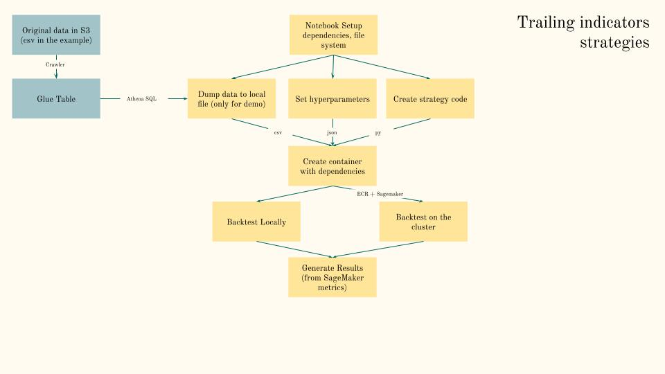
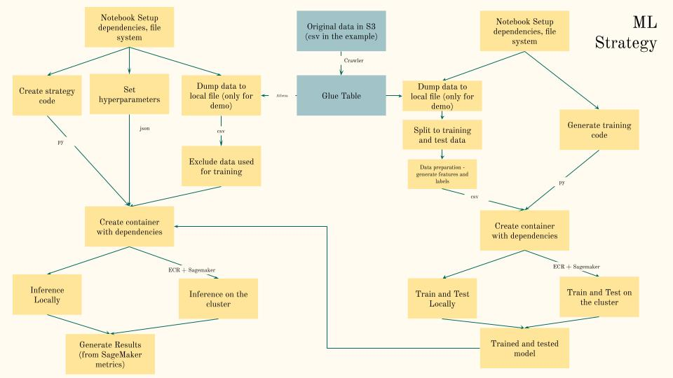

# Algorithmic Trading Proof-of-Concept

This proof-of-concept (POC) demonstrates a machine learning-based quantitative research environment for algorithmic trading. This is a completely serverless implementation, creating backtesting environment as-a-code, scaling up the instances during backtesting and shutting everything down at the end of the run. The POC shows how to load and store financial data in AWS hosted Iceberg tables (market data and news sentiment data from Alphavantage), and how to build and backtest algorithmic trading strategies with SageMaker AI using technical indicators and advanced machine learning models. Training and inference can be performed both locally and on the ephemeral cluster, which is spun and shut down automatically. You will notice, that there is no need to provision EC2 or VPC at all, everything is based on the AWS-managed services and a declarative configuration source. 

> The goal is to demonstrate the MLOps pipeline. Several reasonably realistic algorithms are included for demonstration purposes. This is a demo, not a production trading algorithm. Training is performed on synthetic data. The objective is to showcase the quant platform setup, not to demonstrate real alpha. Please ignore the negative Sharpe ratio and PnL; the focus is on demonstrating the platform, not on trading performance.

---

The POC has currently 4 strategies implemented, with one more under development:

### 1. Machine Learning Long/Short Prediction Strategy

An advanced strategy that leverages a pre-trained neural network (MLP) to predict the probability of profitable long or short trades, using technical indicators as features.

**Logic:**

- **Feature Engineering:**
    - Inputs: Current close price, multiple SMAs (2–16), and Rates of Change (ROCs) over various periods.
    - SMAs are normalized; ROCs are used as-is.
- **ML Model Prediction:**
    - The model outputs two probabilities: one for a long opportunity, one for a short opportunity.
- **Trade Signals:**
    - **Go Long (Buy):** If the long probability exceeds a configurable threshold.
    - **Go Short (Sell):** If the short probability exceeds a configurable threshold.
- **Position Management:**
    - **Long Position:** Exit if price reaches a profit target (e.g., +2%) or a stop-loss (e.g., -1.5%).
    - **Short Position:** Exit if price reaches a profit target (e.g., -2%) or a stop-loss (e.g., +1.5%).

**Risk Management:**

- Built-in via configurable profit target and stop-loss percentages.

**Configuration:**

- `long_threshold`: Probability threshold for entering long trades.
- `short_threshold`: Probability threshold for entering short trades.
- `profit_target_pct`: Profit target as a percentage.
- `stop_loss_pct`: Stop-loss as a percentage.
- `size`: Trade size per signal.

---

### 2. Alternative Data Machine Learning Long/Short Prediction Strategy

Very similar to the previous strategy, but also uses news-based sentiment to train the model. In addition to the closing price SMA, it takes the SMA of the news sentiment over 1–16 days.
The sentiment is specific to the backtested symbol, so if a news article mentiones more than a single symbol, the sentiment taken into the account by the model is the symbol sentiment, not
the article sentiment. For example, if the article says "AMD (AMD) beats Intel (INTC) in the race to the Moon", the sentiment of the article will be bullish, the AMD sentiment will be strongly
bullish however the esentimend of INTC will be negative. If we backtest single stock INTC, only the negative INTC sentiment will be taken into account by the model

---

### 3. Enhanced Alternative Data ML Long/Short Prediction Strategy

A future enhancement will add sentiment for competitors and the industry segment. To determine which symbols represent competitors, GenAI will be used. To identify the segment a symbol belongs to, the external security master provided by Alphavantage will be queried.

---

### 4. Simple Moving Average (SMA) Crossover Strategy

This classic trend-following strategy uses two Simple Moving Averages (SMAs) with different periods:

- **Fast SMA:** Shorter period, reacts quickly to price changes.
- **Slow SMA:** Longer period, smooths out price fluctuations.

**Logic:**

- **Go Long (Buy):** When the fast SMA crosses above the slow SMA, signaling an uptrend.
- **Go Short (Sell):** When the fast SMA crosses below the slow SMA, signaling a downtrend.
- **Position Reversal:** If an opposing signal occurs while a position is open, the strategy reverses the position to align with the new trend direction.

**Risk Management:**

- No explicit stop-loss or take-profit; the strategy relies on signal reversals for exits.

**Configuration:**

- `fast_period`: Period for the fast SMA.
- `slow_period`: Period for the slow SMA.
- `size`: Trade size per signal.

---

### 5. Daily Breakout Strategy

A momentum-based strategy that seeks to capture strong price movements by identifying breakouts from recent highs or lows.

**Logic:**

- **Go Long (Buy):** When the current price exceeds the highest high over a configurable look-back period.
- **Go Short (Sell):** When the current price falls below the lowest low over the look-back period.
- **Exit Long:** If the price drops below the previous period's high.
- **Exit Short:** If the price rises above the previous period's low.
- The strategy can be configured to only go long, only go short, or both.

**Risk Management:**

- Exits are triggered by price reversals relative to the breakout levels.

**Configuration:**

- `period`: Look-back period for high/low calculation.
- `go_long`: Enable/disable long trades.
- `go_short`: Enable/disable short trades.
- `size`: Trade size per signal.

---

All strategies generate a typical backtesting chart and provide raw trade-by-trade data.

---

## Architecture Overview

You will notice, that this is a completely serverless implementation. When backtesting isn't run, the only consumed resource is the S3 bucket. Upon start of the backtesting, AWS will spin the required infrastructure without the need from the user to provision EC2 instances, VPC or anything else. 

1. **Environment Setup:**  
   Use CloudFormation to create the environment (clusters, SageMaker, roles, Iceberg tables, and Data Lake).
2. **Data Generation:**  
   Data is downloaded using a AWS Glue ETL process from Alphavantage (both news and market data). It is then stored in Iceberg tables, and data governance is managed through Data Lake. Spark is used to create the Iceberg tables. Athena is used to access the data from the backtesting engine.  
   Both options are included to demonstrate the platform's capabilities.
3. **Strategy Backtesting:**  

   - Non-ML strategies (SMA, Breakout) use the data directly.

   - ML-based strategies (see `2_Strategies/Strategy_ML_Forecast.ipynb`) involve an intermediate model training step (`3_Models/Train_Model_Forecast.ipynb`). Similarly for `Strategy_ML_Forecast_with_Sentiment`.

4. **Parameter Optimization:**  
   Each strategy has a hyperparameter file for running various parameter combinations during backtesting. The backtesting then parallelizes multiple backtesting instances, each dealing with an specific set of the parameters. In this implementation the sets of hyperparametrs are hardcoded. In the future I plan to write enhancements whoch will optimize hyperparameters using Grid search and Bayesian Optimization

5. **Containerization:**  
   Strategies and associated dependencies are packaged in a Docker container. 

6. **Backtesting**
Backtesting then can be run locally (on the Jupyter notebook server) or on a ECS Cluster via Fargate. AWS Fargate is a technology that you can use with Amazon ECS to run containers without having to manage servers or clusters of Amazon EC2 instances. When executing worlkoad on the ECS, users can specify the size of the cluster and the specs of the servers (for example, types of GPU to use, whether to use preemptible instanbces and so on)
7. **Logging:**  
   Execution logs are sent to AWS CloudWatch.

## Flow Diagram

---

## Quick Start: SageMaker Notebooks

### Step 0: Set Up Environment

1. [Get an Alphavantage API key](https://www.alphavantage.co/support/#api-key) (free and easy).
2. Deploy the [CloudFormation template](https://bitbucket.org/imalinovsky/algorithmic-trading/src/main/0_Setup/algo-reference.yaml) for SageMaker Notebook, Athena, and Glue Iceberg Tables. Go to [CloudFormation](https://console.aws.amazon.com/cloudformation/home?#/stacks/new?stackName=algotrading) and upload the template. This will create a non-VPC version of the setup, where Internet access is provided by SageMaker. During the deployment specify the  Alphavantage API key you obtained in the previous step.

---
### Step 1: Load Historical Price Data
All subsequent steps are performed using [SageMaker Studio](https://us-east-1.console.aws.amazon.com/sagemaker).  
Open SageMaker Studio, navigate to Notebooks, and select the `AlgorithmicTradingInstance` notebook. Start and open Jupyter if it is not already running.
This step will generate sample EOD price data and news sentiment data from a public source. Run all cells in `1_Data/Load_data_Alphavantage.ipynb`.

---

### Step 2: Train Models

There are two notebooks in the `3_Models` directory:
- [Train_Model_Forecast](https://bitbucket.org/imalinovsky/algorithmic-trading/src/main/3_Models/Train_Model_Forecast.ipynb)
- [Train_Model_Forecast_with_Sentiment](https://bitbucket.org/imalinovsky/algorithmic-trading/src/main/3_Models/Train_Model_Forecast_with_Sentiment.ipynb)

Run each to train the corresponding model. This will produce `.h5` files with trained models, which will later be used for inference.

### Step 3: Backtesting

Backtest any or all of the strategies in [`2_Strategies`](https://bitbucket.org/imalinovsky/algorithmic-trading/src/main/2_Strategies/):

- [Breakout](https://bitbucket.org/imalinovsky/algorithmic-trading/src/main/2_Strategies/Strategy_Breakout.ipynb)

- [SMA](https://bitbucket.org/imalinovsky/algorithmic-trading/src/main/2_Strategies/Strategy_SMA.ipynb)

- [Short-Long Forecast](https://bitbucket.org/imalinovsky/algorithmic-trading/src/main/2_Strategies/Strategy_ML_Forecast.ipynb)

- [Short-Long Forecast with Sentiment](https://bitbucket.org/imalinovsky/algorithmic-trading/src/main/2_Strategies/Strategy_ML_Forecast_with_Sentiment.ipynb)

---

## Acknowledgements

This work is based on the AWS blog post:  
[Algorithmic Trading with SageMaker and AWS Data Exchange (Feb 2021)](https://aws.amazon.com/blogs/industries/algorithmic-trading-on-aws-with-amazon-sagemaker-and-aws-data-exchange/)  
Thanks to the authors for their ideas and code contributions.